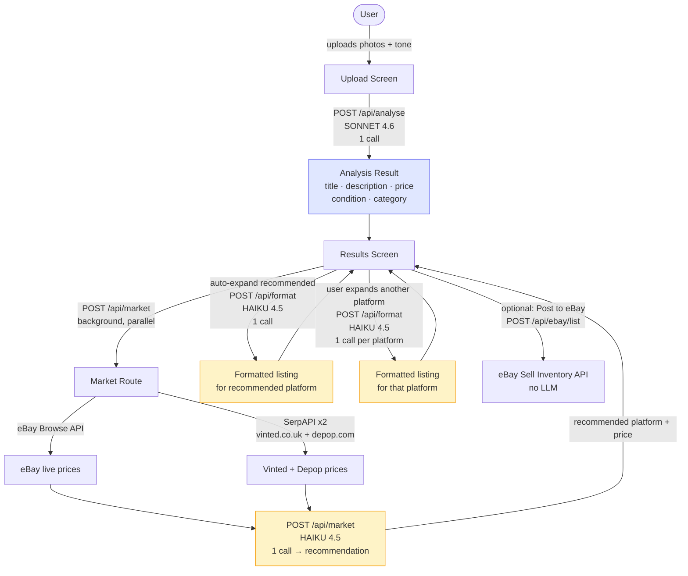

# Architecture

## LLM Call Flow

## LLM Calls Summary

| Call | Model | When | Trigger |
|---|---|---|---|
| `/api/analyse` | claude-sonnet-4-6 | On "Analyse item" click | Always — 1 per item |
| `/api/market` synthesis | claude-haiku-4-5-20251001 | Background after analyse | Always — 1 per item |
| `/api/format` | claude-haiku-4-5-20251001 | On platform card expand | Lazy + cached — 1 per platform, max 3 |

**Minimum per item: 2 LLM calls** (analyse + market synthesis)
**Maximum per item: 5 LLM calls** (analyse + market + format all 3 platforms)

Format calls are lazy — only fired when the user opens a platform card — and cached in React state for the session, so each platform is only formatted once.

## API Routes

| Route | Runtime | Purpose |
|---|---|---|
| `POST /api/analyse` | Edge | Photo analysis → neutral listing via Sonnet |
| `POST /api/format` | Edge | Reformat listing for a specific platform via Haiku |
| `POST /api/market` | Node.js | Fetch live prices from eBay + SerpAPI, synthesise recommendation via Haiku |
| `POST /api/group` | Node.js | Group photos by clothing item via Haiku (bulk mode) |
| `POST /api/ebay/list` | Node.js | Create + publish eBay draft listing via Sell Inventory API |
| `GET /api/auth/ebay/connect` | Node.js | Initiate eBay OAuth flow |
| `GET /api/auth/ebay/callback` | Node.js | Handle OAuth callback, store encrypted tokens |
| `GET /api/auth/ebay/status` | Node.js | Check eBay connection status |
| `DELETE /api/auth/ebay/disconnect` | Node.js | Remove eBay connection |
