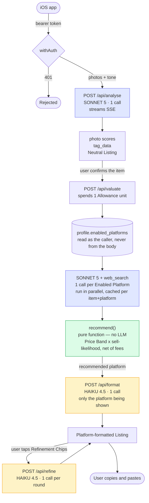

# Architecture

Every route runs on the **Node runtime** and requires a Supabase bearer token —
there are no anonymous requests, because the Allowance meter needs someone to
meter ([ADR-0007](./docs/adr/0007-metered-from-day-one.md)). Handlers are
wrapped in `withAuth` from `src/lib/auth.ts`.

## Call flow

## API routes

| Route | Purpose | LLM |
|---|---|---|
| `POST /api/analyse` | Photos → photo quality scores, tag OCR, Neutral Listing. One JSON object covering all three concerns. Streams SSE. | Sonnet 5 × 1 |
| `POST /api/valuate` | `ValuationItem` → a Price Band per Enabled Platform, plus a Recommendation. Spends one Allowance unit. | Sonnet 5 × *n* platforms |
| `POST /api/format` | Neutral Listing + platform + tone → a Platform-formatted Listing | Haiku 4.5 × 1 |
| `POST /api/refine` | Platform-formatted Listing + Refinement Chips → a rewritten one | Haiku 4.5 × 1 |
| `GET` / `PATCH /api/profile` | The caller's Enabled Platforms and Allowance | none |

## Models

Set in one place, `src/lib/llm/client.ts`:

| Job | Model | Why |
|---|---|---|
| `analyse` | `claude-sonnet-5` | Multi-image reasoning, and everything downstream is built on its output |
| `valuation` | `claude-sonnet-5` | Needs `web_search_20260209`, and judging whether a result is genuinely comparable *is* the product |
| `format` | `claude-haiku-4-5-20251001` | Rewriting text it has already been given |
| `refine` | `claude-haiku-4-5-20251001` | Same, one instruction at a time |

## Cost per item

| | Calls |
|---|---|
| One Enabled Platform | **3** — analyse, one Price Band, one format |
| Three Enabled Platforms | **5** — analyse, three Price Bands, one format |
| Each Refinement Chip round | +1 Haiku call |

Only Enabled Platforms are valued, so cost scales with what each user actually
sells on. Price Bands are cached per item+platform, and `format` runs for the
platform being shown rather than fanning out across all three
([ADR-0004](./docs/adr/0004-unified-valuation-core.md)).

## Two things the design deliberately protects

**Enabled Platforms are read from the caller's profile, never from the request
body.** A client that could name its own platforms could ask for work it had
not enabled, and the meter charges one unit however many platforms that turns
out to be.

**The Allowance unit is reserved before the work, not counted after it.** Two
valuations racing on one account must not both spend the last unit, so the
check and the decrement are a single SQL statement (`spend_allowance`). Work
that then fails is refunded — a failed valuation costs the user nothing.

## What is not here

- **No publishing.** The eBay OAuth flow, token encryption and Sell Inventory
  call were removed ([ADR-0003](./docs/adr/0003-ebay-oauth-and-publishing-removed.md));
  Bower hands the user text to paste.
- **No sold-price data.** Comparables are what people are *asking* today, found
  by web search ([ADR-0005](./docs/adr/0005-asking-price-valuation.md)). The
  SerpAPI + Apify + scraper stack this used to need is gone.
- **No web UI.** The Next.js app is API routes only
  ([ADR-0001](./docs/adr/0001-ios-only-web-ui-removed.md),
  [ADR-0002](./docs/adr/0002-headless-nextjs-api-on-vercel.md)).
- **No image storage.** Photos are sent in the request and not persisted.
